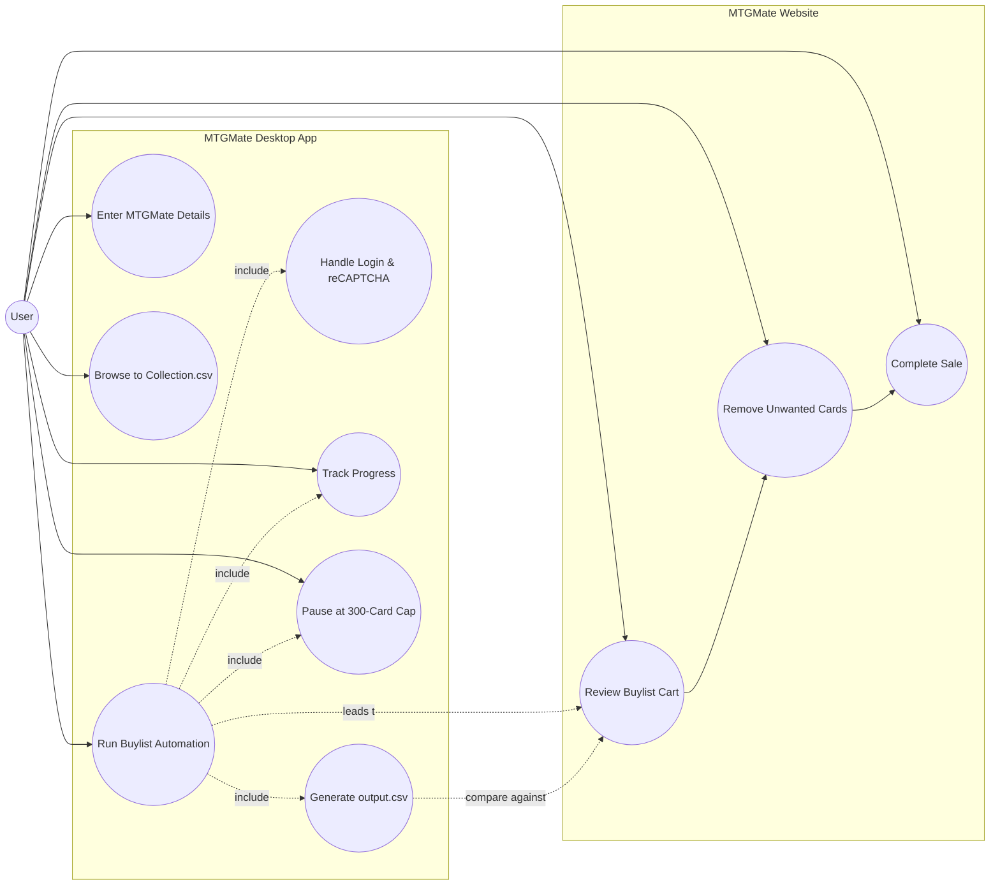

# MTGMate — Use Case Diagram

## Actor
- **User** 

## Use Cases (current)
- Configure Collection & Settings 
- Find cards to sell
- Run Buylist Automation 
- Handle Login 
- Track Progress 
- Pause at 300-Card Cap
- Generate output.csv

