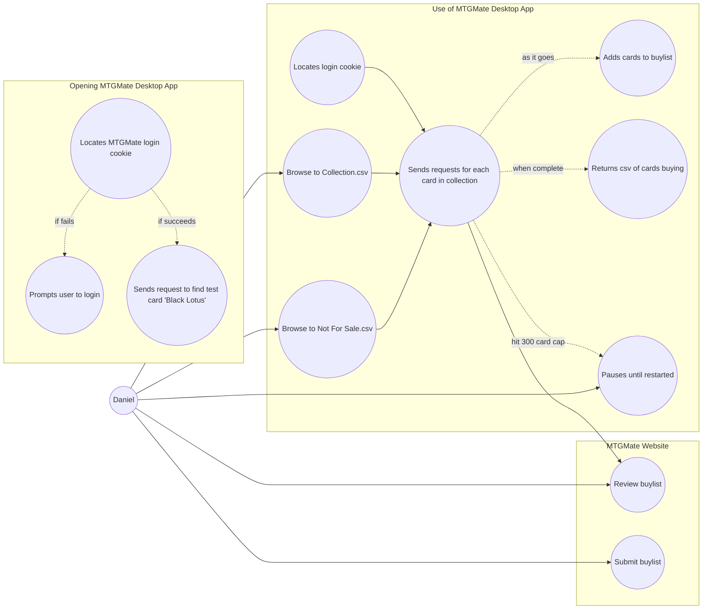

# MTGMate — Use Case Diagram

```mermaid
flowchart LR
    User(("Daniel"))

    subgraph Opening MTGMate Desktop App
        UC1(("Locates MTGMate login cookie"))
        UC2(("Prompts user to login"))
        UC4(("Sends request to find test card 'Black Lotus'"))
    end

    subgraph Use of MTGMate Desktop App
        UC3(("Browse to Collection.csv"))
        UC5(("Browse to Not For Sale.csv"))
        UC6(("Locates login cookie"))
        UC7(("Sends requests for each card in collection"))
        UC8(("Adds cards to buylist"))
        UC9(("Returns csv of cards buying"))
        UC10(("Pauses until restarted"))
    end

    subgraph MTGMate Website
        UC11(("Review buylist"))
        UC12(("Submit buylist"))

    end

    UC1 -.if fails.-> UC2
    UC1 -.if succeeds.-> UC4
    User --> UC3
    User --> UC5
    UC6 --> UC7
    UC3 --> UC7
    UC5 --> UC7
    UC7 -.as it goes.-> UC8
    UC7 -.when complete.-> UC9
    UC7 -.hit 300 card cap.-> UC10
    UC7 --> UC11
    User --> UC10
    User --> UC11
    User --> UC12

```

